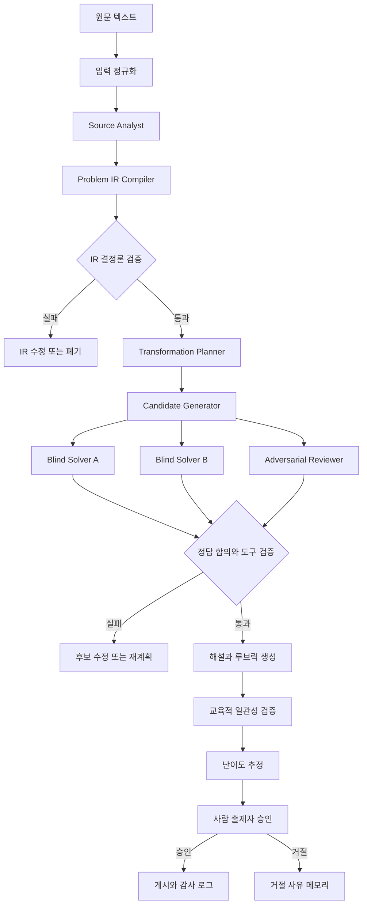

# 공통수학2 서술형 문제 변형·생성기 — 기술 타당성 및 권고 아키텍처 연구보고서

> 원본 노션 페이지 ID: `3b9f7750-a058-810d-9b28-c2703f50c8c3`  
> 상태: **최종 판단: 조건부로 구현 가능**

공통수학2의 제한된 범위에서 고품질 서술형 변형 문항을 실제로 생성하는 것은 가능하다. 다만 **LLM 단독 프롬프트 생성**으로는 수학적 정확성·유일해·조건 완전성·부분점수 일관성을 보증할 수 없다. 권고안은 **문제 구조 IR/DSL + 제한된 에이전트 역할 분리 + SymPy 기반 결정론적 검증 + 서로 독립적인 블라인드 풀이 + 적대적 검수 + 사람 출제자 승인**을 결합한 하이브리드 파이프라인이다.

---

## 문서 정보
- **작성일:** 2026-08-12
- **대상 독자:** 개발자·ML 엔지니어
- **1차 적용 범위:** 고등학교 1학년 2학기 중간고사, 2022 개정 교육과정 공통수학2
- **우선 문항:** 중간 결과물과 부분점수 기준을 포함하는 서술형 문항
- **입력:** 텍스트 문항
- **필수 출력:** 변형 문항, 최종 답, 단계별 해설, 채점 기준, 부분점수 기준, 변형 설명, SymPy 검증 결과
- **핵심 변형 원칙:** 핵심 개념만 유지하고 표현·상황·관점·표현 방식·조건 구조·질문 방향 등은 적극적으로 변경
- **검증 원칙:** CAS/SymPy, 복수 모델 교차검증, 사람 출제자 최종 승인 모두 사용
- **제외 범위:** 단순 수치 치환형 쌍둥이 문제, 사업성·시장성, 저작권·법률 검토, 기존 유사도 측정 보고서

## 연결 문서
- [수학문제 변형&생성기 개요](../README.md)
- [리서치 전 질문 체크리스트](01_리서치_전_질문_체크리스트.md)
- [기술 실현 가능성 및 권고 아키텍처 심층 보고서](03_기술_실현_가능성_및_권고_아키텍처_심층보고서.md)

---

# 1. 의사결정 요약

## 1.1 채택할 아키텍처
**Hybrid Symbolic-First Generation Pipeline**을 채택한다.
1. 원문을 바로 재작성하지 않고 먼저 **문제 구조 IR**로 컴파일한다.
2. IR에서 핵심 개념·조건·목표·풀이 DAG·중간 채점 지점을 분리한다.
3. 변형 계획을 먼저 만들고, 최소 변형 차원을 충족한 계획만 문장으로 실현한다.
4. 생성 모델과 다른 계열의 모델들이 정답을 보지 않은 채 독립적으로 문제를 푼다.
5. SymPy와 제한된 실행 환경이 해·정의역·유일성·항등식·교점·반례를 검증한다.
6. 적대적 검수기가 누락 조건, 다중 정답, 퇴화 사례, 불필요한 조건, 의도하지 않은 풀이를 찾는다.
7. 검증된 풀이 DAG를 기준으로 해설과 부분점수 루브릭을 만든다.
8. 사람 출제자가 마지막 출시 게이트를 통과시킨다.

## 1.2 채택하지 않을 방식
- **단일 LLM 원샷 생성:** 출력은 빠르지만 수학적 오류와 조건 누락을 안정적으로 차단할 수 없다.
- **무제한 다중 에이전트 토론:** 에이전트 수나 토론 라운드를 늘린다고 품질이 단조 증가하지 않으며, 상관된 오류와 비용이 늘어난다.
- **수치만 교체하는 템플릿:** 검증은 쉽지만 사용자가 요구한 깊은 변형을 충족하지 않는다.
- **LLM 다수결만으로 검증:** 동일한 학습 분포와 추론 편향을 공유할 수 있어 독립적인 증거가 아니다.
- **완전 자율 출제·무검수 게시:** 현 단계에서는 허용하지 않는다.

## 1.3 구현 가능성의 경계
| 구분 | 판단 | 조건 |
|---|---|---|
| 제한된 단원 PoC | 가능 | 구조화된 IR, 결정론적 검증, 사람 승인 필요 |
| 공통수학2 전 범위 | 단계적 확장 가능 | 단원별 verifier와 변형 정책을 별도 설계 |
| 학교별 상위권 난이도 자동 보정 | 초기에는 잠정 추정만 가능 | 목표 학생군의 실제 응답 데이터가 있어야 보정 가능 |
| 오류 가능성 0인 완전 자동 생성 | 불가한 운영 가정 | 중요 문항은 사람 승인 게이트 유지 |

---

# 2. 조사 질문과 방법

## 2.1 핵심 조사 질문
1. LLM이 단순 숫자 치환을 넘어 핵심 개념만 유지한 새 수학 문항을 만들 수 있는가?
2. 생성된 문항이 답을 가지며, 답이 유일하고, 조건이 충분하다는 것을 어떻게 검증할 것인가?
3. 단계별 해설과 부분점수 기준을 문제의 실제 풀이 구조와 일치시킬 수 있는가?
4. 상위권 학생 정답률이라는 난이도 목표를 어떻게 측정하고 보정할 것인가?
5. OpenAI API와 DeepSeek API를 어떤 역할 분담과 실패 격리 방식으로 결합할 것인가?

## 2.2 조사 범위
- 수학 문항 생성 및 통제 생성 연구
- 다중 에이전트 생성·비평·검증 연구
- 수학 풀이 검증 및 단계 오류 탐지 연구
- 반례·조건 누락·답 불가능 문항 생성 연구
- SymPy 기반 대수·기하·집합·논리 검증 능력과 한계
- OpenAI·DeepSeek의 구조화 출력, 도구 호출, 평가·에이전트 기능
- 관련 오픈소스의 구현 성숙도와 재사용 가능성

## 2.3 교육과정 전제
한국교육과정평가원과 국가교육과정정보센터 자료를 기준으로 공통수학2는 크게 **도형의 방정식, 집합과 명제, 함수와 그래프** 영역을 포함한다. 학교별 중간고사 진도는 다를 수 있으므로 시스템에는 고정된 전 범위가 아니라 `school_scope_profile`을 두고, 학교·시험별 허용 성취요소와 문제 유형을 설정하도록 한다.

초기 PoC는 다음 순서를 권고한다.
1. **도형의 방정식:** 좌표·방정식·교점·거리·원·접선 등은 기호 검증과 수치 반례 탐색이 비교적 강하다.
2. **집합과 명제:** 유한집합·논리식·충족 가능성은 명시적 정의역을 두면 검증하기 좋다.
3. **함수와 그래프:** 정의역·치역·역함수·합성함수·유리·무리함수는 분기와 정의역 처리가 더 복잡하므로 이후 확장한다.

---

# 3. 연구 결과

## 3.1 문항 생성 연구에서 얻은 설계 원칙
| 근거 | 핵심 결과 | 본 시스템에 주는 함의 |
|---|---|---|
| [Multi-Agent Collaborative Framework for Math Problem Generation](https://arxiv.org/abs/2511.03958) | 교사·비평가·합의 역할과 제한된 반복이 관련성, 명확성, 난이도, 답 가능성 평가에 유용하다. 그러나 비정제 다중 에이전트와 추가 라운드가 항상 개선을 보장하지 않는다. | 역할은 분리하되 상태 머신이 반복 횟수와 통과 조건을 통제해야 한다. |
| [Self-Evolving Multi-Role Framework](https://arxiv.org/abs/2601.11792) | 샘플러·생성기·평가기·상태·기억을 분리하고 난이도 피드백을 누적하는 구조를 제안한다. | 승인·거절 이유를 구조화해 다음 생성의 정책 메모리로 사용한다. |
| [ControlMath](https://aclanthology.org/2024.emnlp-main.680/) | 수식·계산 구조를 먼저 만들고 문제 문장을 구성한 뒤 역검증하는 제어 생성이 효과적이다. | 문장 생성보다 먼저 기호적 청사진과 검증 계약을 확정한다. |
| [Computational Blueprints](https://aclanthology.org/2025.emnlp-industry.97/) | 계산 청사진을 이용한 안정적인 대규모 생성과 배포 사례를 제시한다. | 숫자 쌍둥이 생성 자체는 제외하지만, 결정론적 청사진 계층은 채택한다. |
| [TreeCut](https://aclanthology.org/2025.acl-short.84/) | 필수 조건을 체계적으로 제거해 답 불가능 문제를 만들고 모델의 취약성을 시험한다. | 각 후보에 대해 조건 제거·약화 테스트를 실행해 문제의 충분성과 필수성을 점검한다. |
| [GSM-Symbolic](https://arxiv.org/abs/2410.05229) | 숫자나 절을 조금만 바꿔도 모델 성능이 크게 변하며, 관련 있어 보이는 불필요한 조건에도 취약하다. | 동일 의미 재표현, 수치 교란, 불필요 조건 삽입 테스트를 검증 세트에 포함한다. |
| [LLM Critics Help Catch Bugs in Mathematics](https://aclanthology.org/2025.findings-acl.753/) | 단계별 자연어 비평이 수학 검증기의 효율과 오류 발견을 개선한다. | 최종 답 일치뿐 아니라 풀이 단계별 주장과 근거를 검증 대상으로 저장한다. |
| [Hard2Verify](https://aclanthology.org/2026.acl-long.1031/) | 단계 수준 수학 검증은 여전히 어렵고, 공개 검증기와 강한 폐쇄형 모델 사이에도 격차가 있다. | 단일 자동 검증기를 최종 진실 판정기로 사용하지 않고 사람 게이트를 유지한다. |
| [VerifiAgent](https://aclanthology.org/2025.findings-emnlp.891/) | 추론 유형에 따라 도구를 선택하고 검증 결과 자체를 다시 점검하는 메타 검증을 제안한다. | 대수·기하·논리별 verifier를 라우팅하고 `UNRESOLVED` 상태를 명시한다. |

## 3.2 오픈소스 재사용성 평가
- [QA_GEN](https://github.com/aminsmd/QA_GEN): 다중 에이전트 생성 워크플로를 빠르게 이해하는 참고 구현이다. 코드 규모와 유지보수 이력은 작아 프로덕션 기반으로 직접 채택하기보다 역할 분리와 평가 흐름만 참고한다.
- [IMPG](https://github.com/eric-jhoon/IMPG): Computational Blueprints 논문의 저장소이나 현재 공개 구현 범위가 제한적이다. 논문 수준의 아이디어 참고용이다.
- [treecut-math](https://github.com/j-bagel/treecut-math): 필수 조건 제거와 답 가능성 공격 테스트 구현을 참고할 수 있다.
- [ToRA](https://github.com/microsoft/ToRA): 자연어 추론과 외부 계산 도구를 교차 사용하는 설계의 참고점이다.
- [DeepMath](https://github.com/IntelLabs/DeepMath): 제한된 샌드박스에서 짧은 계산 코드를 실행하는 보안·감사 패턴을 참고할 수 있다.
- [SymPy](https://github.com/sympy/sympy): 핵심 대수·기하·집합·논리 검증 엔진으로 직접 사용한다.

> ⚠️ 논문 코드와 데모 저장소는 아키텍처 아이디어를 검증하는 데 유용하지만, 그대로 제품 핵심 런타임으로 채택할 수준의 운영성·관측성·보안·장애 복구를 제공한다고 가정해서는 안 된다. 핵심 상태 머신과 검증 게이트는 자체 애플리케이션 코드로 구현한다.

---

# 4. 권고 시스템 아키텍처



## 4.1 핵심 설계 원칙
- **애플리케이션이 오케스트레이터다.** 모델이 다음 에이전트를 자유롭게 호출하거나 최종 상태를 결정하지 않는다.
- **모든 에이전트 출력은 스키마를 가진다.** 자연어 설명만 남기지 않고 JSON Schema/Pydantic 모델로 파싱한다.
- **결정론적 게이트가 우선한다.** 모델의 자신감이나 다수결보다 기호 계산, 반례, 정의역, 유일해 검사를 먼저 신뢰한다.
- **독립성을 설계한다.** 생성자와 풀이자에게 동일한 참조 해설을 공유하지 않고, 가능하면 서로 다른 공급자·모델 스냅샷을 사용한다.
- **불확실성은 실패 폐쇄 방식으로 처리한다.** SymPy가 판단하지 못하거나 모델 간 풀이가 충돌하면 `PASS`가 아니라 `UNRESOLVED`로 분류한다.
- **수정 횟수는 제한한다.** 후보당 최대 2회의 수정 이후에도 통과하지 못하면 폐기한다.
- **모든 산출물은 재현 가능해야 한다.** 모델·프롬프트·스키마·IR·검증 코드·시드·도구 결과·사람 결정의 버전을 저장한다.

## 4.2 권고 상태 머신
```
INGESTED -> NORMALIZED -> ANALYZED -> IR_COMPILED -> IR_VERIFIED 
 -> PLAN_APPROVED -> CANDIDATES_GENERATED -> NOVELTY_VERIFIED -> TOOL_VERIFIED 
 -> CROSS_SOLVED -> ADVERSARIAL_VERIFIED -> PEDAGOGY_VERIFIED 
 -> DIFFICULTY_ESTIMATED -> HUMAN_APPROVED -> PUBLISHED
```

---

# 5. 구성요소 상세 명세

## 5.1 역할별 책임과 출력 계약
| 구성요소 | 책임 | 금지 사항 | 주요 출력 |
|---|---|---|---|
| Input Normalizer | 텍스트·수식·기호·단위·문항 번호를 정규화 | 문제 의미를 임의로 보정 | 정규화 텍스트, 파싱 경고 |
| Source Analyst | 교육과정 태그, 핵심 개념, 조건, 목표, 풀이 구조를 추출 | 변형 문항 작성 | 원문 분석 객체 |
| IR Compiler | 분석을 형식화하고 검증 가능한 계약으로 컴파일 | 검증 불가능한 자연어만 저장 | ProblemIR |
| Transformation Planner | 유지할 핵심 개념과 변경할 차원을 계획 | 문장만 바꾸거나 숫자만 교체 | TransformationPlan |
| Candidate Generator | 승인된 계획에서 여러 후보를 생성 | 정답·검증 결과를 사실로 단정 | CandidateProblem 배열 |
| Blind Solver A/B | 참조 답 없이 독립적으로 풀이 | 서로의 풀이 또는 원문 해설 열람 | 풀이 단계, 답, 가정, 불확실성 |
| Tool Verifier | SymPy·열거·수치 샘플링으로 검증 계약 실행 | 판단 불능을 통과로 처리 | VerificationReport |
| Adversarial Reviewer | 누락 조건·퇴화·다중 정답·우회 풀이·모호성을 탐색 | 문제 장점을 설명하는 일반 비평 | 반례 또는 통과 근거 |
| Pedagogy Agent | 검증된 풀이 DAG에서 해설과 루브릭을 작성 | 검증 전 새로운 풀이 경로를 임의 생성 | 해설, 채점 기준, 부분점수 |
| Difficulty Estimator | 구조 특성과 실제 응답 데이터로 난이도 추정·보정 | LLM 인상 점수를 실제 정답률로 표현 | 잠정 또는 보정 난이도 |
| Human Examiner | 수학·교육·학교 출제 적합성을 최종 승인 | 근거 없이 자동 승인 | 승인 상태, 수정·거절 사유 |
