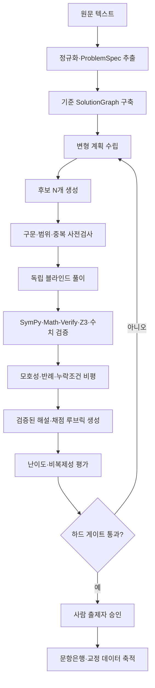

# 공통수학2 서술형 문제 변형·생성기 — 기술 실현 가능성 및 권고 아키텍처 심층 보고서

> 원본 노션 페이지 ID: `3b9f7750-a058-81cd-9775-dba29a1fc1ef`  
> 상태: **최종 판단: 기술적으로 실현 가능 (조건부)**

공통수학2의 텍스트 기반 서술형 문항을 입력받아, 핵심 개념을 유지하면서 표현·상황·관점·조건 구조·질문 목표를 바꾼 후보 문항과 정답, 단계별 해설, 부분점수 기준, 변형 설명, SymPy 검증 결과를 생성하는 것은 **기술적으로 실현 가능**하다.  
다만 단일 LLM의 한 번의 응답을 그대로 출판하는 방식은 권고하지 않는다. 권고안은 **명시적 상태를 가진 타입 안전 DAG 파이프라인 + 독립 블라인드 풀이 + SymPy·Math-Verify·Z3 검증 + 반례 비평 + 사람 최종 승인**이다.

---

## 1. 조사 범위와 전제
- 기준 문서: [수학문제 변형&생성기 개요](../README.md)
- 요구사항 확인: [리서치 전 질문 체크리스트](01_리서치_전_질문_체크리스트.md)
- 대상: 고등학교 1학년 2학기 중간고사 범위의 **공통수학2**
- 입력: 텍스트 문항
- 중심 문항: 중간 결과물이 있고 부분점수를 부여할 수 있는 서술형
- 필수 출력: 변형 문항, 정답·채점 기준, 단계별 해설, 부분점수 기준, 원문 대비 변형 설명, SymPy 검증 증거
- 비복제 원칙: 핵심 개념만 유지하고 그 밖의 요소는 적극적으로 변형
- 정확성 목표: CAS·SymPy 검증, 다중 모델 교차검증, 사람 출제자 승인 모두 적용
- 제외 범위: 시장성·사업성, 저작권·개인정보 리스크, 단순 숫자 치환형 쌍둥이 문제 생성기
- 최종 의사결정: 구현 아키텍처 선정

> ℹ️ 공통수학2의 실제 중간고사 범위는 학교별 진도에 따라 달라질 수 있다. 따라서 시스템에는 `exam_scope`를 필수 설정값으로 두고, 허용 단원·성취기준·선수지식·금지 개념을 실행마다 고정해야 한다.

---

## 2. 답부터 말하면: 무엇까지 가능한가

| 능력 | 현재 판단 | 근거와 조건 |
|---|---|---|
| 다양한 후보 문항 생성 | 높은 실현 가능성 | 교사 주석, 역번역, 방정식·문제 분리 생성, 다중 관점 증강 연구가 반복적으로 가능성을 보임 |
| 핵심 개념 유지 | 중간 이상 | 명시적 `ProblemSpec`과 개념 판정기를 사용해야 함. 자유 프롬프트만으로는 드리프트 발생 |
| 수학적 정확성 | 지원 문제군에서는 높게 만들 수 있음 | 독립 풀이, 기호 검증, 수치·경계값 검증, 유일성·정의역 검사를 모두 통과한 후보만 승인 |
| 서술형 해설·부분점수 | 실현 가능 | 해설 문장 뒤에 루브릭을 붙이는 방식이 아니라 검증된 `SolutionGraph`에서 직접 컴파일해야 함 |
| 비복제성 | 중간 | 표면 유사도뿐 아니라 정규화 수식 AST·풀이 그래프·변형 차원으로 검사해야 함 |
| 상위권 정답률의 정밀 통제 | 초기에는 낮음~중간 | LLM·전문가 평가는 사전 추정치일 뿐. 학생 반응 데이터와 부분점수 IRT 계열 교정이 필요 |
| 완전 무인·무오류 출판 | 권고하지 않음 | 모호성, 누락 조건, 상관된 모델 오류, 검증기 적용 범위 밖의 오류가 남음 |

### 핵심 해석
최근 연구는 LLM이 교육용 수학 문항을 생성할 수 있고, 교사 주석이나 구조화된 생성 절차가 품질을 높인다는 점을 보여 준다. MATHWELL은 교육적 적절성까지 평가하는 교사 주석 기반 접근을 제시했고, MathGenie는 해답을 변형한 뒤 문제를 역생성하고 실행 가능한 풀이로 필터링했다. ControlMath는 방정식 생성과 자연어 문제 제작을 분리하고 역방향 검증 에이전트를 사용했다. [[1]](https://aclanthology.org/2024.findings-emnlp.696/) [[2]](https://aclanthology.org/2024.acl-long.151/) [[3]](https://aclanthology.org/2024.emnlp-main.680/)

다만 이 연구들의 상당수는 초·중등 문장제, 합성 학습 데이터, 벤치마크 성능을 다룬다. **한국 공통수학2의 학교별 장문 서술형, 채점 루브릭, 상위권 정답률을 한 번에 보장한 공개 연구는 확인되지 않았다.** 따라서 본 프로젝트의 결론은 “바로 완전자동화 가능”이 아니라 “검증 가능한 부분집합부터 PoC로 증명할 수 있다”이다.

---

## 3. 연구에서 확인된 설계 원칙

### 3.1 생성과 검증을 분리해야 한다
- 생성 모델이 자신의 답을 스스로 검토하는 것만으로는 충분하지 않다. LLM은 정답뿐 아니라 중간 추론의 옳고 그름을 평가할 때도 흔들릴 수 있다. [[4]](https://aclanthology.org/2024.findings-acl.524/)
- 과정 감독 연구는 최종 답만 보는 것보다 중간 단계별 정확성을 점검하는 방식이 더 효과적일 수 있음을 보여 준다. [[5]](https://openai.com/index/improving-mathematical-reasoning-with-process-supervision/)
- PROVE는 생성된 추론을 실행 가능한 프로그램과 대조해 불일치 경로를 제거하는 방식이 단순 다수결보다 낫다는 결과를 보고했다. [[6]](https://arxiv.org/abs/2410.12608)
- StepCo는 오류가 있는 단계를 찾아 수정하는 `verify -> revise` 루프를 제안했다. [[7]](https://arxiv.org/abs/2410.12934)

**설계 결론:** 생성기, 독립 풀이기, 기호 검증기, 모호성 비평기는 서로 다른 역할과 입력을 가져야 한다. 특히 독립 풀이기에는 생성기의 정답·해설을 처음부터 보여 주지 않는다.

### 3.2 자연어 문항보다 먼저 수학 구조를 표현해야 한다
DMath는 중간 풀이를 표현식 트리와 Python 코드로 제공하며 영어·한국어 수학 문장제의 구조화된 평가 가능성을 보여 준다. [[8]](https://aclanthology.org/2023.emnlp-main.927/)
자동문항생성 연구에서도 먼저 조작 가능한 요소를 가진 item model을 만들고, 요소를 변형한 뒤, 생성 문항의 심리측정 특성을 평가하는 절차가 핵심으로 제시되어 왔다. [[9]](https://mcc.ca/wp-content/uploads/Technical-Reports-Gierl-Lai-2012.pdf)

**설계 결론:** 제품의 핵심 자산은 프롬프트가 아니라 `ProblemSpec`, `TransformationPlan`, `SolutionGraph`, `ValidationEvidence`라는 중간표현이다.

### 3.3 “풀 수 없는 문제”를 별도로 검출해야 한다
TreeCut 연구는 필요한 조건을 제거해 의도적으로 답할 수 없는 문항을 만들었을 때 모델이 그럴듯한 답을 지어내는 경향을 보였다. [[10]](https://aclanthology.org/2025.acl-short.84/)

**설계 결론:** 정답 일치만 검사해서는 안 된다. 다음을 별도 판정해야 한다:
- 조건의 일관성: 해가 존재하는가
- 충분성: 주어진 정보만으로 목표가 결정되는가
- 유일성: 단일 정답을 요구한다면 답이 유일한가
- 정의역: 분모 0, 제곱근, 로그, 좌표 퇴화 등 숨은 예외가 없는가
- 진술 모호성: 자연어 해석이 두 가지 이상 가능한가

### 3.4 난이도는 텍스트만 보고 확정할 수 없다
문항 난이도 예측에서 언어모델과 텍스트 특성은 유용한 사전 추정치를 제공하지만, 실제 난이도는 응답 자료를 이용한 문항반응이론 교정이 기준이 된다. 전문가 판단과 소규모 학습자 정보는 초기 prior로 쓸 수 있으나 최종 난이도와 동일하지 않다. [[11]](https://doi.org/10.1016/j.compedu.2011.11.020)

**설계 결론:** MVP에서는 “예상 난이도”와 “실측 난이도”를 데이터 모델에서 분리한다.

---

## 4. 권고 아키텍처

### 4.1 선택안
**명시적 상태 머신 또는 DAG 기반 검증형 멀티스테이지 파이프라인**을 선택한다.
- 자유롭게 대화하는 에이전트 군집이 아니라, 각 노드의 입력·출력 스키마와 통과 조건이 고정된 워크플로를 사용한다.
- LLM은 의미 해석·변형·비평에 쓰고, 기호 연산·제약 충족·동치 판정은 결정론적 도구에 위임한다.
- 어느 단계에서든 증거가 부족하면 자동 승인하지 않고 재생성 또는 사람 검토로 보낸다.
- 모든 호출과 검증 결과를 재현 가능한 실행 기록으로 남긴다.



---

## 5. 핵심 중간표현 설계 (Pydantic Schema)

```python
from __future__ import annotations
from typing import Literal
from pydantic import BaseModel, Field

class MathStatement(BaseModel):
    id: str
    natural_language: str
    sympy_expr: str | None = None
    domain: str | None = None

class ProblemSpec(BaseModel):
    curriculum_version: str
    exam_scope: list[str]
    core_concepts: list[str]
    auxiliary_concepts: list[str]
    givens: list[MathStatement]
    unknowns: list[str]
    objective: MathStatement
    answer_type: Literal[
        "integer", "rational", "real", "expression",
        "set", "interval", "coordinate", "proof", "multi_part"
    ]
    assumptions: list[str]
    expected_methods: list[str]
    forbidden_knowledge: list[str]
    target_upper_group_correct_rate: tuple[float, float] | None

class TransformationPlan(BaseModel):
    preserved: list[str]
    changed_dimensions: list[Literal[
        "context", "representation", "objective",
        "condition_topology", "condition_order",
        "auxiliary_construction", "solution_route", "data_domain"
    ]]
    change_description: list[str]
    prohibited_patterns: list[str]

class SolutionNode(BaseModel):
    id: str
    statement: MathStatement
    prerequisites: list[str]
    justification: str
    verifier: Literal["sympy", "z3", "numeric", "human"]
    points: float = Field(ge=0)
    alternative_group: str | None = None
    fatal_if_wrong: bool = False

class SolutionGraph(BaseModel):
    nodes: list[SolutionNode]
    final_node_ids: list[str]
    total_points: float

class ValidationEvidence(BaseModel):
    schema_pass: bool
    scope_pass: bool
    satisfiable: bool | None
    answer_unique: bool | None
    independent_answers: list[str]
    symbolic_checks: list[dict]
    numeric_checks: list[dict]
    ambiguity_flags: list[str]
    novelty_vector: dict[str, float]
    difficulty_prior: dict[str, float]
    supported_for_auto_gate: bool
```

---

## 6. 하드 게이트 조건 (Hard Gates)

후보는 다음을 모두 통과해야 사람 승인 대기 상태로 이동한다:
- [ ] 스키마·수식 파싱 성공
- [ ] 시험 범위와 핵심 개념 일치
- [ ] 최소 변형 차원 수 충족 (4개 이상)
- [ ] 단순 숫자·변수 치환 패턴 아님
- [ ] 조건 만족가능
- [ ] 요구 시 정답 유일
- [ ] 생성기와 독립 풀이기의 최종 답 동치
- [ ] 핵심 중간 결과 노드 동치
- [ ] 모든 SymPy·Z3·수치 검증 통과
- [ ] 정의역·경계·퇴화 사례 위반 없음
- [ ] 모호성·누락조건 플래그 없음
- [ ] 해설과 루브릭이 검증된 `SolutionGraph`에서 파생됨
- [ ] 검증기가 지원하는 문제 유형임
