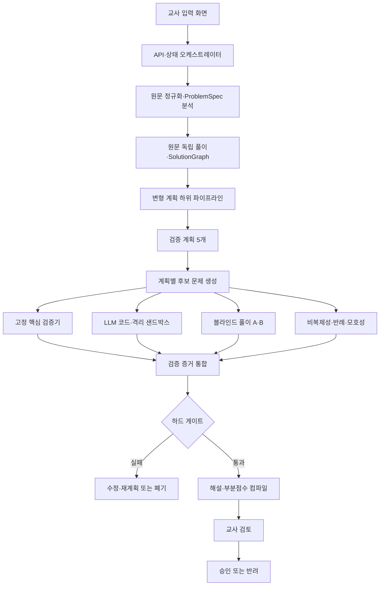

# 수학문제 변형기 MVP — 구현 작업 지침

> 원본 노션 페이지 ID: `3b9f7750-a058-81f7-a0ad-c6b7b9a5ae3c`  
> 상태: **기획 및 작업 정의 완료 (구현 진행)**

> 🎯 **목표:** 공통수학2 도형의 방정식 서술형 원문을 입력받아, 핵심 개념을 유지하면서 구조적으로 충분히 다른 문제를 만들고, 정답·해설·부분점수·변형 설명·검증 증거와 함께 교사에게 제공한다.  
> **개발 원칙:** 좋은 문제를 한 번에 쓰는 모델보다, 잘못된 후보가 왜 탈락했는지 증거를 남기며 검증된 후보만 살아남는 시스템을 만든다.

---

## 1. 기준 문서
- [수학문제 변형&생성기 개요](../README.md)
- [리서치 전 질문 체크리스트](01_리서치_전_질문_체크리스트.md)
- [기술 타당성 및 권고 아키텍처 연구보고서](02_기술_타당성_및_권고_아키텍처_연구보고서.md)
- [기술 실현 가능성 및 권고 아키텍처 심층 보고서](03_기술_실현_가능성_및_권고_아키텍처_심층보고서.md)

---

## 2. 확정 범위

### 포함
- **사용자:** 교사·문항 제작자
- **입력:** 텍스트 기반 공통수학2 서술형 원문
- **우선 영역:** 좌표·직선, 원·접선·교점, 이동·대칭
- **출력:** 변형 문제, 최종 답, 단계별 해설, 채점 기준, 부분점수, 변형 설명, 검증 증거
- **화면:** 원문 입력, 범위 설정, 진행 상태, 후보 비교, 증거 확인, 승인·반려·재생성
- **기본 생성 정책:** 변형 계획 8개 생성 -> 검증된 계획 5개 선택 -> 계획당 후보 1개 생성 -> 통과 후보 최대 3개 표시

### 구현 외
- 학생 계정과 학생용 풀이 화면
- 학생 답안 제출·자동채점
- 학생 반응 수집과 IRT 난이도 보정
- 집합·명제·함수 영역 (초기 범위 제외)
- OCR·이미지 중심 문항
- GNN 유사도 모델
- 교사 승인 없는 자동 게시

---

## 3. 시스템 구조

### 핵심 데이터 계약
- `ScopeProfile`: 허용 단원·성취기준·개념·답 형태·검증 지원 범위
- `ProblemSpec`: 기호·정의역·가정·조건·목표·개념·답 형태
- `SolutionGraph`: 의존성을 가진 풀이 단계·검증기·대안 경로·채점 지점
- `TransformationPlan`: 보존 요소·변형 차원·구성 청사진·예상 풀이 그래프·검증 계약
- `CandidateProblem`: 문제 본문·형식화·주장 답·풀이·변형 근거
- `ValidationEvidence`: 고정·샌드박스·풀이·반례 검사의 입력·결과·반례·상태
- `Rubric`: 풀이 노드와 연결된 점수·동치 표현·대표 오류·대안 경로
- `GenerationRun`: 전체 상태·재시도·비용·지연·버전·사람 판단

---

## 4. 구현 단계 (P0 ~ P7)

- **P0 기반·품질 골격:** 프로젝트 구조, CI 검사, 보안 경계
- **P1 도메인 계약·저장:** 데이터 모델, 상태 머신, DB 저장소
- **P2 원문 분석:** 정규화, Source Analyst, Baseline Solver
- **P3 격리 샌드박스:** Docker 격리 런타임, 실행 계약, 보안
- **P4 변형 계획·후보 생성:** 카탈로그, 계획 생성기, Candidate Generator
- **P5 다중 검증·루브릭:** SymPy verifier, Blind Solvers, Rubric Compiler
- **P6 API·교사 화면:** FastAPI 엔드포인트, Next.js 리뷰 UI
- **P7 통합 품질·교사 PoC:** E2E 테스트, Red Teaming, 최종 검증

---

## 5. 작업 데이터베이스 연결
모든 개별 태스크 상세 및 완료 게이트는 [TASKS_INDEX.md](../tasks/TASKS_INDEX.md) 문서에서 다룹니다.
