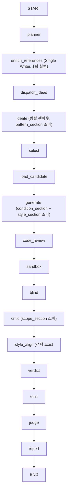

# 참조 자산 주입 계층 (Reference Layer) 통합 아키텍처 및 상세 설계

> **설계 근거**: `docs/integration/00~06` 문서  
> **구현 지침**: `docs/integration/06_구현_프롬프트_마스터.md`의 M1~M6 로드맵 및 하드 제약(비파괴 확장, TDD 강제, LangChain 생태계 프리미티브 준수, 완전 패리티) 적용

---

## 1. 개요 및 설계 목표

고등학교 수학 문항 변형·생성 파이프라인(`math-variant`)에 기출 시험지, 조건 표현 코퍼스, 교육과정 지식체계, 개념서 해설 스타일 등 풍부한 참조 자산을 비파괴적으로 주입하여 생성 문항의 학교 시험 정합성, 발문 완성도, 해설 신뢰성을 대폭 향상시킨다.

### 핵심 설계 원칙
1. **완전한 패리티 (Parity Guarantee)**: 참조 자산이 비활성화(`"off"`)되거나 빈 경우 기존 프롬프트와 문자 단위 100% 동일한 프롬프트가 조립된다.
2. **LangChain Native 아키텍처**: 모든 리트리버는 `langchain_core.retrievers.BaseRetriever`를 상속하며, LCEL `RunnableParallel`과 LangGraph의 단방향 상태 흐름(`enrich_references` 노드)으로 제어된다.
3. **양대 파이프라인 일관성**: 기존 `httpx` 파이프라인(`AgentPipeline`)과 `LangGraph` 파이프라인(`LangChainPipeline`)이 동일한 LCEL Runnable 및 렌더러를 공유하여 동일한 참조 문자열을 주입받는다.
4. **엄격한 TDD (Red → Green → Refactor)**: 모든 마일스톤(M1~M6)에서 실패하는 테스트를 먼저 작성하고 최소 구현으로 통과시킨 후 회귀 검증을 수행한다.
5. **원문 복사 오염 원천 차단**: 기출·개념서 원문 문장을 저장하지 않고, 추상화된 패턴, 발문 관례, 용어 목록 형태로만 인덱싱·주입한다.

---

## 2. 모듈 구조 및 데이터 계층

```
src/math_variant/
├── reference/                          # 신규: 참조 자산 계층
│   ├── __init__.py
│   ├── models.py                       # ExamPatternCard, ConditionPhrasing, SolutionStyle, CurriculumScope
│   ├── exam_retriever.py               # BaseRetriever: 기출 출제 패턴 검색
│   ├── condition_retriever.py          # BaseRetriever: 조건 표현 관례 검색
│   ├── style_retriever.py              # BaseRetriever: 해설 서술 스타일 검색
│   ├── curriculum.py                   # CurriculumScope 로더 및 C08 범위 필터링
│   ├── knowledge_graph.py              # 지식체계 인덱스 및 skill_id 부여 (순수 함수)
│   └── sections.py                     # 역할별 텍스트 렌더러 + LCEL build_reference_runnable()
├── data/                               # M1 스크립트로 생성된 읽기 전용 인덱스 (UTF-8)
│   ├── reference_exam_patterns.jsonl
│   ├── condition_style_index.json
│   ├── solution_style_guide.json
│   └── scope_profile.json
├── agents/                             # 기존 에이전트 확장 (선택 키워드 인자)
│   ├── planner.py                      # plan(*, scope_section="")
│   ├── ideator.py                      # ideate(*, pattern_section="")
│   ├── generator.py                    # generate(*, condition_section="", style_section="")
│   ├── critic.py                       # criticize(*, scope_section="")
│   └── pipeline.py                     # httpx 파이프라인의 참조 실행 및 주입
└── langchain_generator/                # LangGraph 파이프라인 확장
    ├── pipeline.py                     # enrich_references 노드 + PipelineContext/State 확장
    └── pipeline_factory.py             # scope_profile 및 reference_data_dir 설정 스위치
```

---

## 3. M1: 오프라인 인덱스 추출기 (`scratch/build_*.py`)

모든 빌더는 규칙 기반(정규식·빈도 집계)의 순수 함수로 구현되며 LLM을 호출하지 않는다. 원본 저장소(`generateQuestion2`)는 읽기 전용으로 취급한다.

| 스크립트 | 입력 소스 | 주요 처리 로직 | 출력 산출물 |
|---|---|---|---|
| `scratch/build_exam_patterns.py` | 시험지 structured 21개 | 단원 분류, 발문 패턴 정규식 요약, 조건절 n-gram(수식/변수 `_` 치환) 집계, 원문 미포함 추상 카드 생성 | `data/reference_exam_patterns.jsonl` |
| `scratch/build_condition_style_index.py` | dataset_2nd_term_final 3,868건 | `assigned_topic_id` C08 필터링, 조건절 패턴 빈도 집계 (빈도 2 미만 제거) | `data/condition_style_index.json` |
| `scratch/build_solution_style_guide.py` | 개념서 OCR 566건 | 단원별 대표 해설의 접속어, 수식 변환 순서, 정당화 어휘 규칙 기반 추출 | `data/solution_style_guide.json` |
| `scratch/build_scope_profile.py` | `math_curriculum_db.csv` (EUC-KR)<br>`수학_지식체계_데이터_세트_210611.json` | C08(공통수학2) 허용 토픽 및 C09 이상 금지 단원 파싱, 개념명→지식체계 ID 매핑 인덱스 빌드 | `data/scope_profile.json` |

---

## 4. M2: 리트리버 및 LCEL 체인 인터페이스

### 리트리버 인터페이스
- `langchain_core.retrievers.BaseRetriever` 상속 (`_get_relevant_documents(query: str) -> list[Document]`).
- `query`는 쉼표로 구분된 토픽 문자열(예: `"C08-01-03,원의 방정식"`)을 입력받는다.
- 매칭 순위: `topic_id` 완전 일치 → 개념명 부분 일치 → 상위 단원(C08-01) 폴백 → 빈 리스트 반환(예외 발생 없음).
- `k` 매개변수는 리트리버 생성자에서 지정한다 (Exam: `k=3`, Condition: `k=5`, Style: `k=1`).

### LCEL 병렬 합성 체인 (`reference/sections.py`)
- **입력 스키마**: `{"topics": "C08-01-03,원의 방정식"}` (단일 키 문자열).
- **체인 구현**:
  ```python
  def build_reference_runnable(
      exam_retriever: ExamPatternRetriever,
      condition_retriever: ConditionStyleRetriever,
      style_retriever: SolutionStyleRetriever,
  ) -> Runnable[dict[str, str], dict[str, Any]]:
      return RunnableParallel(
          patterns=RunnableLambda(lambda x: exam_retriever.invoke(x["topics"])),
          phrasings=RunnableLambda(lambda x: condition_retriever.invoke(x["topics"])),
          style=RunnableLambda(lambda x: style_retriever.invoke(x["topics"])),
      )
  ```
- **안전한 빈 값 처리**: `style`이 `None`인 경우 `generator_style_section(None) -> ""`로 렌더링되어 프롬프트에 아무것도 부착되지 않는다.

---

## 5. M3 & M4: 에이전트 주입 및 파이프라인 오케스트레이션

### 1) 에이전트 4종 시그니처 및 주입 위치
모든 에이전트는 선택적 키워드 전용 인자(기본값 `""` / `None`)를 받는다.

```python
# PlannerAgent (agents/planner.py)
def plan(self, source_text: str, difficulty_target: str = "", *, scope_section: str = "") -> PlannerOutput:
    # [원문] 직전에 scope_section 부착 (~400 토큰)

# IdeatorAgent (agents/ideator.py)
def ideate(self, brief: str, seed: str, forbidden_structure: list[str] | None = None, *, pattern_section: str = "") -> IdeationOutput:
    # [입력] 직전에 pattern_section 부착 (~250 토큰)

# GeneratorAgent (agents/generator.py)
def generate(self, candidate_id: str, blueprint: dict[str, Any], brief: str, feedback: str = "", forbidden_structure: list[str] | None = None, *, condition_section: str = "", style_section: str = "") -> tuple[CandidateProblem, GeneratorOutput]:
    # [문제 구조] 직전에 condition_section -> style_section 순으로 부착 (~650 토큰, REVISE 루프에서도 유지)

# CriticAgent (agents/critic.py)
def criticize(self, problem_text: str, spec_brief: str, strategy_brief: str, candidate_id: str = "critic", source_text: str = "", forbidden_structure: list[str] | None = None, *, scope_section: str = "") -> CriticOutput:
    # 프롬프트 최하단(말미)에 "\n\n[교육과정 정합 평가]\n{scope_section}" 부착 (~200 토큰)
```

> **설계 확정 노트**: `PlannerAgent`는 `core_concepts`를 자체 생성하기 전이므로 `condition_section`을 사전에 받을 수 없으며, 오직 고정 자산인 `scope_section`만 수신한다. `condition_refs`는 플래너 이후 검색되어 `GENERATOR`에 주입된다. (doc 02의 `SOURCE_ANALYZER` 사전 참조는 v2 후보로 이관).

### 2) LangGraph 파이프라인 오케스트레이션 (`langchain_generator/pipeline.py`)



- **`PipelineState` 확장**:
  ```python
  class PipelineState(TypedDict, total=False):
      ...
      exam_patterns: list[dict]
      condition_refs: list[dict]
      style_guide: dict | None
  ```
- **리듀서 불필요 근거**: `enrich_references`는 `planner` 직후, `dispatch_ideas` 병렬 팬아웃 이전에 단 1회 실행되는 단일 작성자(Single-Writer) 노드이므로 리듀서가 불필요하다.
- **Off/None 처리**: 리트리버가 `None`이면 빈 리스트/`None`을 기록하고, 렌더러가 `""`을 생성하여 기존 동작과 100% 동일하게 유지된다.

### 3) httpx 파이프라인 오케스트레이션 (`agents/pipeline.py`)
- `AgentPipeline.__init__`에 기본값을 갖는 키워드 인자 추가:
  ```python
  def __init__(
      self,
      ...,
      scope_section: str = "",
      reference_runnable: Runnable | None = None,
      critic_scope_section: str = "",
  ) -> None:
  ```
- `_run()` 내부에서 `planner.plan(..., scope_section=self.scope_section)` 실행 직후:
  ```python
  if self.reference_runnable:
      topics_query = ",".join(planner_out.core_concepts)
      ref_data = self.reference_runnable.invoke({"topics": topics_query})
      pattern_section = ideator_pattern_section(ref_data.get("patterns", []))
      condition_section = generator_condition_section(ref_data.get("phrasings", []))
      style_section = generator_style_section(ref_data.get("style"))
  else:
      pattern_section = condition_section = style_section = ""
  ```
  추출된 섹션을 `ideator.ideate()`, `generator.generate()`(REVISE 재시도 포함), `critic.criticize()`로 전달한다.

---

## 6. M5 & M6: 지식체계 매핑 및 스타일 정렬

### M5: `assign_skill_ids` → `transformation_evidence` Append
- `GeneratorAgent.generate` 성공 직후 호출:
  ```python
  knowledge_graph.assign_skill_ids(
      solution_steps=output.solution_steps,
      concepts=planner_out.core_concepts,
  )
  ```
- `CandidateProblem.transformation_evidence` (`list[dict[str, Any]]`)에 추가:
  - 매칭 성공: `{"dimension": "skill_mapping", "step_id": "step-1", "skill_id": "3142", "concept_name": "원의 방정식의 표준형"}`
  - 매칭 실패: `{"dimension": "skill_mapping", "step_id": "step-2", "skill_id": None, "reason": "no_match"}`

### M6 (선택): `style_align` 노드 (solveSkill Grounding 패턴)
- **범위 한정**: LangGraph 파이프라인 전용 노드로 구현 (httpx 파이프라인 미지원으로 과설계 방지).
- **활성화 조건**: 환경변수 `MATH_VARIANT_STYLE_ALIGN=1` AND `style_guide is not None` AND `critic.recommendation in ("PASS", "REVISE")`.
- **기능**: 수학적 풀이 논리를 보존하면서 `solution_steps` 서술 양식만 표준 교재 형태로 재작성.

---

## 7. TDD 구현 및 회귀 검증 매트릭스

각 마일스톤 시작 시 테스트를 먼저 작성하여 **Red(실패) 확인 후** 구현을 시작한다.

```
[마일스톤 TDD 사이클]
1. 테스트 작성 (tests/unit/reference/... Red 확인)
2. 최소 구현 (src/math_variant/reference/... Green 달성)
3. Refactor (ruff check / mypy 통과)
4. 회귀 검증 (pytest tests/unit -q 및 scratch/verify_parity.py)
```

| 마일스톤 | 신규 테스트 파일 | 핵심 검증 케이스 (Red 선행) | 회귀 검증 |
|---|---|---|---|
| **M1** | `tests/unit/reference/test_index_builders.py` | 4종 빌더 순수 함수 변환, n-gram 정규화, EUC-KR CSV 파싱, C08 필터 | `pytest tests/unit` |
| **M2** | `tests/unit/reference/test_retrievers.py`<br>`tests/unit/reference/test_sections.py` | `BaseRetriever.invoke` 계약, 3종 매칭 폴백, LCEL 병렬 체인, `style: None` 빈 문자열 처리 | `verify_parity.py` |
| **M3** | `tests/unit/reference/test_curriculum.py`<br>`tests/unit/agents/test_planner_ref.py`<br>`tests/unit/agents/test_critic_ref.py` | `PlannerAgent`/`CriticAgent` 프롬프트 합성, 스위치 on/off 패리티 | 기존 에이전트 단위 테스트 |
| **M4** | `tests/unit/agents/test_ideator_ref.py`<br>`tests/unit/agents/test_generator_ref.py`<br>`tests/unit/langchain_generator/test_enrich_node.py` | `enrich_references` 상태 전파, `ideator`/`generator` 프롬프트 합성, REVISE 루프 섹션 보존 | `test_pipeline_graph.py` |
| **Dual Parity** | `tests/unit/reference/test_parity.py` | **httpx `AgentPipeline`과 `LangChainPipeline`의 모든 프롬프트 문자 단위 100% 동일성 검증** | `verify_parity.py` |
| **M5** | `tests/unit/reference/test_knowledge_graph.py`<br>`tests/unit/reference/test_skill_mapping.py` | `assign_skill_ids` 매칭 및 null 기록, 리포트 직렬화 호환성 | 전체 유닛 테스트 |
| **M6** | `tests/unit/langchain_generator/test_style_align.py` | `style_align` 조건부 실행 및 풀이 단계 재작성 검증 | 전체 유닛 테스트 |

---

## 8. 완료 기준 및 필수 검증 명령

모든 마일스톤 완료 시 아래 4개 명령어가 무경고·무에러로 통과해야 한다.

```powershell
.\.venv\Scripts\python.exe -m ruff check src tests scratch
.\.venv\Scripts\python.exe -m mypy
.\.venv\Scripts\python.exe -m pytest tests\unit -q
.\.venv\Scripts\python.exe scratch\verify_parity.py
```
